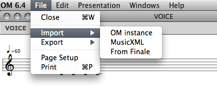
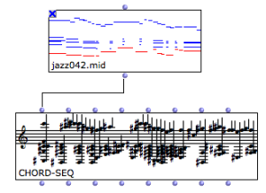
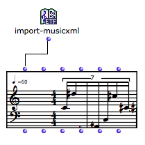
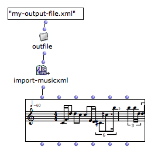
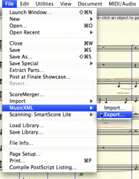

# Import

Importing OM musical objects from external files can be done from the boxes'
contextual menu, orfrom the score editors (menu `File / Import`).

Import/Export Formats and Generalities

  * [Export / Import](ImportExport)

 **Other possibilities exist using the OM patch boxes and objects, which are
detailed in the next sections.**

##  MIDI Import

The easiest way to import MIDI data in OM is to instanciate a **MIDIFile**
box. Several options are possible :

  * Evaluate the box and choose a file on the disk.

  * Connect a pathname to the box input.

  * Drag the file from your computer folder to an OM patch editor.

|

  
  
---|---  
  
Lock the Box

Remember to lock the box after the file is loaded, in order to avoid
initializing it again at every subsequent box evaluation.

Evaluating/Locking Boxes

  * [Evaluation](Evaluation)

The MIDIfile box can then be connected to a chord-seq or multi-seq in order to
convert the data to OM musical object formats.

|

  
  
---|---  
  
MIDI to Voice/Poly

Importing a MIDI file to a voice or poly object is not straightforward since
MIDI has no rhythmic information. An approximate quantification will be
performed using the metric information available.

About Quantification

  * [Quantification](Quantification)

## MusicXML Import

MusicXML files can be imported and loaded into **voice** or **poly** objects
from the `Import` menus or using the **import-musicxml** box.

At evaluation, the **import-musicxml** box opens a file chooser dialog
allowing to select a file to import.

|

  
  
---|---  
  
An optional input allows to specify the file pathname directly in the patch
editor.

|

  
  
---|---  
  
More About Pathnames in OM

  * [Creating and Using Pathnames](Pathnames)

Import-MusicXML Output Value

The import-musicxml output is always a **POLY** object. If a **VOICE** is
connected, only the first voice of the imported score will be loaded.

Creating a MusicXML file from Finale

MusicXML files can be created by Finale via the` File / MusicXML / Export`
menu.

|

[zoom](../res/exp_scr_1.png "Zoom \(nouvelle fenêtre\)")  
  
---|---  
  
References :

Plan :

  * [OpenMusic Documentation](OM-Documentation)
  * [OM 6.6 User Manual](OM-User-Manual)
    * [Introduction](00-Sommaire)
    * [System Configuration and Installation](Installation)
    * [Going Through an OM Session](Goingthrough)
    * [The OM Environment](Environment)
    * [Visual Programming I](BasicVisualProgramming)
    * [Visual Programming II](AdvancedVisualProgramming)
    * [Basic Tools](BasicObjects)
    * [Score Objects](ScoreObjects)
      * [Presentation](Score-Objects-Intro)
      * [Rhythm Trees](RT)
      * [Score Players](ScorePlayer)
      * [Score Editors](ScoreEditors)
      * [Quantification](Quantification)
      * [Export / Import](ImportExport)
        * [Export](Export)
        * Import
    * [Maquettes](Maquettes)
    * [Sheet](Sheet)
    * [MIDI](MIDI)
    * [Audio](Audio)
    * [SDIF](SDIF)
    * [Lisp Programming](Lisp)
    * [Errors and Problems](errors)
  * [OpenMusic QuickStart](QuickStart-Chapters)

Navigation : [page precedente](Export "page précédente\(Export\)") |
[page suivante](Maquettes "page suivante\(Maquettes\)")

