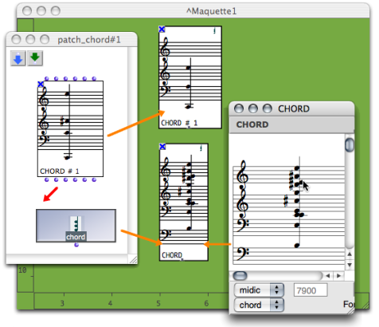
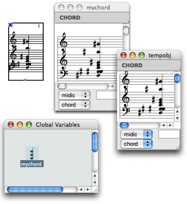

# Instances

## Instance Boxes and Factory Boxes

Dropping an instance or factory box in a maquette editor automatically
generates a copy in this editor.

Copies of factory boxes and instances can be modified via this editor, without
affecting the master item.

Instances modified in the maquette editor.

## Global Variables

Conversely, modifications of global variables have an effect on all their
representations, like in patches.

References :

Plan :

  * [OpenMusic Documentation](OM-Documentation)
  * [OM 6.6 User Manual](OM-User-Manual)
    * [Introduction](00-Sommaire)
    * [System Configuration and Installation](Installation)
    * [Going Through an OM Session](Goingthrough)
    * [The OM Environment](Environment)
    * [Visual Programming I](BasicVisualProgramming)
    * [Visual Programming II](AdvancedVisualProgramming)
    * [Basic Tools](BasicObjects)
    * [Score Objects](ScoreObjects)
    * [Maquettes](Maquettes)
      * [Creating a Maquette](Maquette)
      * [TemporalBoxes](TemporalBoxes)
        * [Adding TemporalBoxes](AddingTempbox)
        * [Elementary Manipulations](elementary)
        * [Temporalboxes Appearance](Appearance)
        * [TemporalBoxes Value](TempValues)
          * [Patches](PatchValue)
          * [Sub Maquettes](MaquetteValue)
          * Instances
      * [The Maquette Editor](Editor)
      * [Maquette Programming](Programming%20Maquette)
      * [Maquettes in Patches](Maquettes%20in%20Patches)
    * [Sheet](Sheet)
    * [MIDI](MIDI)
    * [Audio](Audio)
    * [SDIF](SDIF)
    * [Lisp Programming](Lisp)
    * [Errors and Problems](errors)
  * [OpenMusic QuickStart](QuickStart-Chapters)

Navigation : [page precedente](MaquetteValue "page précédente\(Sub
Maquettes\)") | [page suivante](Editor "page suivante\(The Maquette
Editor\)")

