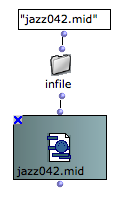
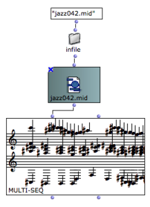

Sommaire

  1. Instantiation
  2. Editor
  3. Extract Data
  4. Save as MIDI File

The **MIDIFile** box represents a MIDI file existing somewhere on your
computer.

## Instantiation

The MIDIFile box is initalized with a **pathname** when the box is evaluated.

If no pathname is connected, a dialog with open and allow you to select a file
on the disk.

|

  
  
---|---  
  
About Pathnames in OM

  * [Creating and Using Pathnames](Pathnames)

Seeing the File Name

Type `n` to display the file name of a selected **MIDIFile** box.

Lock the Box

Do not forget to loack the box (type `b`) if you don't want the file to be
initialized again at each subsequent evaluations.

Drag and Drop the File

a MIDIFile box is also automatically created in your OM patches when you drag
a valid MIDI file from your computer file system in it.

## Editor

Double click teh MIDIFile box to open the MIDI editor.

Standard play controls are available with the floating palette, and time /
pitch values can be read acording to the mouse position.

Each channel is displayed with a different colour. MIDI tracks can be merged
or splitted into separate editor tracks, depending on the `Separate MIDI
tracks` box.

No Data Editon

The MIDI file editor does not allow to edit or modify the copntents of the
MIDI file, but just to display and listen to it.

## Extract Data

Data can be extracted from MIDI files by several different ways.

Conversions to OM objects

By connecting a MIDI file to an OM score object, the data is interpreted in
order to match and fill the object contents depending on its own properties.

For instance, in a multi-seq the different tracks will be dispatched among the
different voices, while in a chord-seq all tracks will be merged into a single
voice.

For voice and poly objects, a quantification process will be applied to try to
find an appropriate rhytmic structure corresponding to the MIDI notes absolute
onsets.

|

  
  
---|---  
  
About OM Score Objects and Quantification

  * [Score Objects Presentation](Score-Objects-Intro)
  * [Quantification](Quantification)

Using the MIDI Toolbox

Several functions in the `MIDI / Inspect/Extract` menu allow to extract data
from a MIDI file.

The more general way of processing MIDI events is the **get-midievents**
method (see MidiEvents section). However, some special methods allow to get
more specific infrmation :

Extracting and Processing MIDI Events

  * [MIDI Events](MIDIEvent)

Extracting MIDI Notes

The **get-midi-notes** method returns a matrix of raw data corresponding to
the MIDI notes.

Each list of the matrix is a track containing notes. A note is a list (pitch
offset duration velocity channel).

|

  
  
---|---  
  
Extracting Lyrics and Textual Info

Textual Info is sometimes stored and encoded in MIDI files.

The **get-mf-lyrics** function extracts all the lyrics of a song converted to
strings.

|

  
  
---|---  
  
Extracting Data to Other MIDI Containers

  * [MIDI Containers](MIDIContainer)

## Save as MIDI File

All Musical and MIDI objects (including maquettes) can be stored in MIDI File,
using the **save-as-midi** method connected to the **MidiFile** box input.

Saving a MULTI-SEQ + MIDI-MIX-CONSOLE values into a MIDI File

In case of simple objects, this is equivalent to exporting the object as a
MIDI file and loading the file in a MIDIFile box.

References :

Plan :

  * [OpenMusic Documentation](OM-Documentation)
  * [OM 6.6 User Manual](OM-User-Manual)
    * [Introduction](00-Sommaire)
    * [System Configuration and Installation](Installation)
    * [Going Through an OM Session](Goingthrough)
    * [The OM Environment](Environment)
    * [Visual Programming I](BasicVisualProgramming)
    * [Visual Programming II](AdvancedVisualProgramming)
    * [Basic Tools](BasicObjects)
    * [Score Objects](ScoreObjects)
    * [Maquettes](Maquettes)
    * [Sheet](Sheet)
    * [MIDI](MIDI)
      * [Introduction](Intro)
      * [Important MIDI Concepts](MIDI-Concepts)
      * [Rendering and Playback](MIDI-Playback)
      * [MIDI Objects](MIDI-Objects)
        * MIDI File
        * [MIDI Events](MIDIEvent)
        * [MIDI Containers](MIDIContainer)
    * [Audio](Audio)
    * [SDIF](SDIF)
    * [Lisp Programming](Lisp)
    * [Errors and Problems](errors)
  * [OpenMusic QuickStart](QuickStart-Chapters)

Navigation : [page precedente](MIDI-Objects "page précédente\(MIDI
Objects\)") | [page suivante](MIDIEvent "page suivante\(MIDI Events\)")

