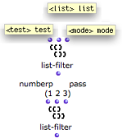
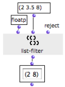

# Predicates: In Practice

Predicates can be used as **conditions** defining the execution of an
operation. Hence, predicates must be connected to

  * the "test" input of an [OMIF box](ConditionalOps),

  * to a function that has a **test argument**.

If a given property or a relation is verified by a predicate, the operation is
performed.

Example : Using a Type Predicate as a Test Argument

|

Here, we want to delete floats from a list with list-filter. List-filter
rejects or passes elements from a list, depending on the predicate taken as
argument.

It has three default inputs :

  1. a predicate, whose default value is numberp

  2. a list

  3. an action - "reject" or "pass". 

  
  
---|---  
  
The floatp predicate and the "reject" option have been assigned to list-
filter, so that floats are rejected.

  * List-filter tests each element of the list successively. 
  * If the test is satisfied, the element is either rejected, or passed, depending on the option that was chosen. 
  * The remaining elements are returned in a list.

|

  
  
---|---  
  
Using a Function on Lambda Mode

A predicate can be a function on "lambda" mode.

|

  
  
---|---  
  
Using a Lambda Function as a Predicate

  * [Lambda Mode Examples: Test Functions](LambdaTest)

References :

Plan :

  * [OpenMusic Documentation](OM-Documentation)
  * [OM 6.6 User Manual](OM-User-Manual)
    * [Introduction](00-Sommaire)
    * [System Configuration and Installation](Installation)
    * [Going Through an OM Session](Goingthrough)
    * [The OM Environment](Environment)
    * [Visual Programming I](BasicVisualProgramming)
    * [Visual Programming II](AdvancedVisualProgramming)
      * [Abstraction](Abstraction)
      * [Evaluation Modes](EvalModes)
      * [Higher-Order Functions](HighOrder)
      * [Control Structures](Control)
        * [Predicates](Predicates)
          * [Comparison Predicates](PredComparison)
          * [Type Predicates](PredTypes)
          * In Practice
        * [Conditional Operators](ConditionalOps)
        * [Logical Operators](Logical)
        * [Sequential Operators](Sequencial)
      * [Iterations: OMLoop](OMLoop)
      * [Instances](Instances)
      * [Interface Boxes](InterfaceBoxes)
      * [Files](Files)
    * [Basic Tools](BasicObjects)
    * [Score Objects](ScoreObjects)
    * [Maquettes](Maquettes)
    * [Sheet](Sheet)
    * [MIDI](MIDI)
    * [Audio](Audio)
    * [SDIF](SDIF)
    * [Lisp Programming](Lisp)
    * [Errors and Problems](errors)
  * [OpenMusic QuickStart](QuickStart-Chapters)

Navigation : [page precedente](PredTypes "page précédente\(Type
Predicates\)") | [page suivante](ConditionalOps "page
suivante\(Conditional Operators\)")

