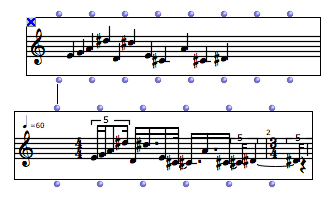
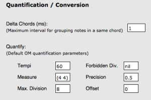
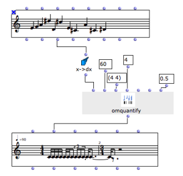
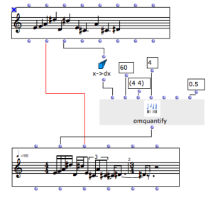

# Quantification

Quantification is the name of the process allowing to convert absolute
durations (for instance, in milliseconds) into a structured rhythmic sequence
of measures with metrics and pulse subdivisions.

In other word and with OpenMusic objects, this is basically what happens when
converting a **chord-seq** , or a MIDI file oject into a **voice**.

Quantification is not an easy task : it implies preliminary information and
adapted approximations in order to be performed correctly. When importing MIDI
files into a voice, for instance, the tempo and metrics information can be
used to better deduce the rhythm corresponding to the raw sequence of onsets
encoded in the MIDI file.

Quantification Parameters

In order to guide the quantification processes, some general parameters can be
set in th OM Preferences (`Quantification` tab): allowed/forbidden rhythmic
subdivisions, tempo, time signatures, etc.

|

  
  
---|---  
  
Even though, some notes in the original sequence may be lost during
quantification. In this case, the following message will appear :

`Warning: with the given constraints, n notes are lost while quantizing`

In this case, the quantification parameters should probably be changed in
order to better match the rhythmic constraints with the initial durations of
the sequence.

Quantification Box

When specific or precise quantification processes need to be performed, you
will generally need to use the **OMQUANTIFY** box in order to convert a
duration list (typically coming from **chord-seq** s or similar data) into a
rhythmic tree suitable to a **voice** object initialization.

About Rhytmic Trees

  * [Rhythm Trees](RT)

The main input of **OMQUANTIFY** is a list of durations.

The orther parameters are similar to the quantification preferences
parameters, but they will apply only to this particular quantification
process.

|

  
  
---|---  
  
Duration from a Chord-Seq

The **X- >DX** function can be used to compute a list of durations starting
from the list of onsets of a chord-seq object.

Nothe that OMQUANTIFY only processes durations to compute a rhythm tree.

Use the pitch information from the initial chord-seq in order to set the
voice's chords slot.

|

  
  
---|---  
  
References :

Plan :

  * [OpenMusic Documentation](OM-Documentation)
  * [OM 6.6 User Manual](OM-User-Manual)
    * [Introduction](00-Sommaire)
    * [System Configuration and Installation](Installation)
    * [Going Through an OM Session](Goingthrough)
    * [The OM Environment](Environment)
    * [Visual Programming I](BasicVisualProgramming)
    * [Visual Programming II](AdvancedVisualProgramming)
    * [Basic Tools](BasicObjects)
    * [Score Objects](ScoreObjects)
      * [Presentation](Score-Objects-Intro)
      * [Rhythm Trees](RT)
      * [Score Players](ScorePlayer)
      * [Score Editors](ScoreEditors)
      * Quantification
      * [Export / Import](ImportExport)
    * [Maquettes](Maquettes)
    * [Sheet](Sheet)
    * [MIDI](MIDI)
    * [Audio](Audio)
    * [SDIF](SDIF)
    * [Lisp Programming](Lisp)
    * [Errors and Problems](errors)
  * [OpenMusic QuickStart](QuickStart-Chapters)

Navigation : [page precedente](Editor-Play "page précédente\(Play
Controls\)") | [page suivante](ImportExport "page suivante\(Export /
Import\)")

