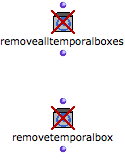
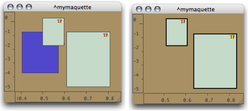
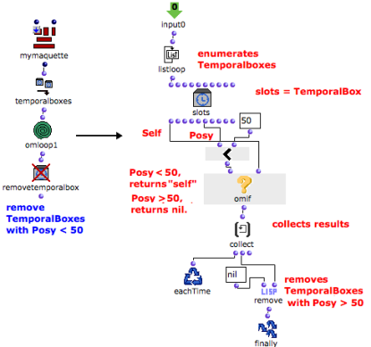

# Removing TemporalBoxes from a Patch :

## Removealltemporalboxes / Removetemporalboxes :

Functionalities

|

The ** removealltemporalboxes ** function allows to remove all TemporalBoxes
of a maquette from a patch.

The  ** removetemporalbox ** function allows to delete one or several selected
TemporalBoxes from a maquette.

  * It must be associated with the temporalboxes function, which returns the list of temporal boxes contained in a maquette. 
  * The boxes to be removed can be defined by  **a number of conditions** via a program. Boxes are checked successively to be eventually removed.
  * The OMLoop module can then be very convenient : it will check each item of the list successively.

  
  
---|---  
  
Procedure

Connect the maquette on "reference" mode to the input of
removealltemporalboxes and evaluate the function.

All the temporal objects of the maquette are deleted.

|

  
  
---|---  
  
## Example : Removing Preexistent Boxes Before Adding New Boxes

Building a Specific Sequence

|

In the following sequence, the maquette is "cleaned" systematically before a
new TemporaBox is added into it. The sequence function applies the following
command line :

(sequence (removealltemporalboxes maquette) (addbox2maquette maquette
temporalboxes) )  
  
---|---  
  
Evaluation

Before the evaluation, the maquette contains three TemporalBoxes. At the
evaluation, all preexistent TemporalBoxes are suppressed from the maquette.

## Example : Removing Boxes According to Posy

In this maquettes, the green boxes "posy" is superior or equal to 50. The
purple boxes "posy" is inferior to 50. The purple TemporalBoxes must be
deleted.

This can be done with two programs :

  * with list-filter and a specific test argument 
  * with an OMLoop box.

|

  
  
---|---  
  
First Option : List-filter

List-filter takes a test argument, a list, and an action : "reject" or "pass"
- "reject" in this case.

  1. Temporalboxes returns a list with the values of each TemporalBox located in the maquette.

  2. The test argument defined in the patch on "lambda" mode checks is the "posy" of each box is superior or equal to 50

  3. List-filter rejects them and returns boxes whose "posy" is inferior to 50. 

  4. Removetemporalboxes is evaluated and removes these Temporalboxes from the maquette.

The test-patch has a slots box and a, OM >= predicate.

The slots box represents a TemporalBox, whose "posy" output is connected to
the >= predicate. The test argument tests if the "posy" of a TemporalBox is
superior or equal to 50.

Removetemporalboxes removes boxes whose value is returned by list-filter, that
is, boxes, whose "posy" is inferior to 50.

Second Option : With OMLoop

This program is very similar to the program above. Here, temporalboxes is
connected to the input of OMLoop, which executes the same task as list-filter.

  1. At each step of the loop, listloop returns the value of a TemporalBox, and the > predicate tests if the "posy" of the slots box is inferior to 50.

Slots stands for a TemporalBox.

    * If this posy is inferior to 50, omif returns it. 
    * Otherwise, it returns "nil". 
  2. The result of the successive evaluations is stored by collect. 

  3. At the end of the iteration, remove removes all "nil" values from the list. 

  4. The list is returned by the output of the OMLoop to removetemporalboxes. 

Evaluation

|

In both cases, when evaluated, removetemporalboxes removes all the items of
the list from the maquette, that is, all the boxes whose "posy" is inferior to
50.  
  
---|---  
  
References :

Plan :

  * [OpenMusic Documentation](OM-Documentation)
  * [OM 6.6 User Manual](OM-User-Manual)
    * [Introduction](00-Sommaire)
    * [System Configuration and Installation](Installation)
    * [Going Through an OM Session](Goingthrough)
    * [The OM Environment](Environment)
    * [Visual Programming I](BasicVisualProgramming)
    * [Visual Programming II](AdvancedVisualProgramming)
    * [Basic Tools](BasicObjects)
    * [Score Objects](ScoreObjects)
    * [Maquettes](Maquettes)
      * [Creating a Maquette](Maquette)
      * [TemporalBoxes](TemporalBoxes)
      * [The Maquette Editor](Editor)
      * [Maquette Programming](Programming%20Maquette)
      * [Maquettes in Patches](Maquettes%20in%20Patches)
        * [Build Mode](Build)
        * [Functional Mode](Maquettes%20in%20Patches1)
        * [Reference Mode](Maquettes%20in%20Patches2)
          * [Adding TemporalBoxes](addprocedure)
          * [Examples](addexamples)
          * [Accessing Boxes](REF3)
          * Removing Boxes
          * [Interaction (1)](REF5)
          * [Interation (2)](Intercation2)
    * [Sheet](Sheet)
    * [MIDI](MIDI)
    * [Audio](Audio)
    * [SDIF](SDIF)
    * [Lisp Programming](Lisp)
    * [Errors and Problems](errors)
  * [OpenMusic QuickStart](QuickStart-Chapters)

Navigation : [page precedente](REF3 "page précédente\(Accessing Boxes\)")
| [page suivante](REF5 "page suivante\(Interaction \(1\)\)")

