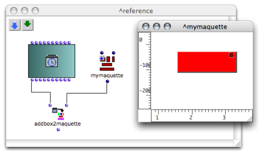

# Reference Mode

## Properties

Use

A box on "reference" mode returns its **own internal reference** . A function,
a factory box, a patch or a maquette on "reference" mode returns returns the
generic function, the class or the program it refers to.

Procedure

To set a box on "reference" mode, select it, press `b` and click three times
on the upper left cross. A small downward arrow 
icon appears.

## Applications

This mode is dedicated to specific tasks : on "reference" mode, a patch box or
a maquette box returns its reference to a function, in order to be manipulated
at runtime.

Example : Manipulating Maquettes

The "reference" mode is used for adding a TemporalBox in a maquette via the
addbox2maquette function.

Maquettes : Reference Mode

  * [Reference Mode](Maquettes%20in%20Patches2)

References :

Plan :

  * [OpenMusic Documentation](OM-Documentation)
  * [OM 6.6 User Manual](OM-User-Manual)
    * [Introduction](00-Sommaire)
    * [System Configuration and Installation](Installation)
    * [Going Through an OM Session](Goingthrough)
    * [The OM Environment](Environment)
    * [Visual Programming I](BasicVisualProgramming)
    * [Visual Programming II](AdvancedVisualProgramming)
      * [Abstraction](Abstraction)
      * [Evaluation Modes](EvalModes)
        * [Lock Mode](LockMode)
        * [Evaluate-Once Mode](EvOnceMode)
        * [Lambda Mode](LambdaMode)
        * Reference Mode
      * [Higher-Order Functions](HighOrder)
      * [Control Structures](Control)
      * [Iterations: OMLoop](OMLoop)
      * [Instances](Instances)
      * [Interface Boxes](InterfaceBoxes)
      * [Files](Files)
    * [Basic Tools](BasicObjects)
    * [Score Objects](ScoreObjects)
    * [Maquettes](Maquettes)
    * [Sheet](Sheet)
    * [MIDI](MIDI)
    * [Audio](Audio)
    * [SDIF](SDIF)
    * [Lisp Programming](Lisp)
    * [Errors and Problems](errors)
  * [OpenMusic QuickStart](QuickStart-Chapters)

Navigation : [page precedente](LambdaMode "page précédente\(Lambda
Mode\)") | [page suivante](HighOrder "page suivante\(Higher-Order
Functions\)")

