Sommaire

  1. Creating Sheet Contents
  2. Display
  3. Time Positions and Display
  4. Editing Objects
  5. Playback

A new OMSheet editor is initially a blank page : there is nothing inside.

A first step is therefore to add tracks and objects in this page. This can be
done beforehand at building the Sheet object in the patch, or directly in the
editor.

|

[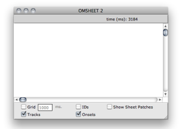](../res/empty-sheet.png "Cliquez pour
agrandir")  
  
---|---  
  
Building the Sheet Structure in a Patch

  * [Building Sheets in Visual Programs](Sheet-Box)

The `Show Sheet Patches` box allows to display ofr hide the patches, that is,
the "algorithmic" part of the sheet. We will not consider it in this section
and focus on the "score" part only.

About The "Algorithmic" Part

  * [Sheet Patches](Sheet-Patch)

## Creating Sheet Contents

Adding/Removing Tracks

New tracks can be added in the sheet using the `File / New Track` menu or
corresponding `CMD` \+ `N` keyboard shortcut.

Select a track and use the delete key ( `<=` ) to remove it.

|

[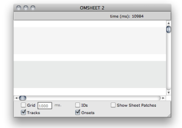](../res/sheet-empty-tracks.png "Cliquez
pour agrandir")  
  
---|---  
  
Adding/Removing Objects

`CMD` \+ Click somewhere in a sheet track to create a new object at this
position.

You can also use the `File / New Object` menu or corresponding `CMD` \+
`SHIFT` \+ `N` keyboard shortcut to create a new object at the end of the
selected track (if any).

Select an object and use the delete key ( `<=` ) to remove it.

|

[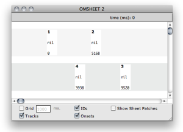](../res/sheet-new-objects.png "Cliquez
pour agrandir")  
  
---|---  
  
New Sheet Objects

Note that new sheet objects are "empty". Their value is NIL.

Objects ID

Note that every object is automatically affected a unique ID number, visible
if the box `IDs` is checked on.

These IDs are mainly used to identify the objects in the "programmatic" part
of the Sheet creation.

Programming Sheets

  * [Sheet Patches](Sheet-Patch)

Setting Contents in Sheet Objects

Here again, there exist several ways of setting the actual contents of a sheet
object.

  1. [At creating the sheet object in a patch](Sheet-Box)

  2. [Using the sheet internal patches](Sheet-Patch)

  3. By dragging and dropping an existing object (from a patch or from the sheet itself) on a sheet object box (see below).

Dragging Objects in The Sheet

[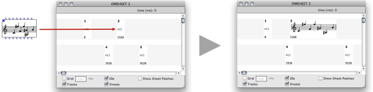](../res/drag-into-sheet.png "Cliquez pour
agrandir")

It is also possibe to drag the value from one object in the sheet to another
one :

[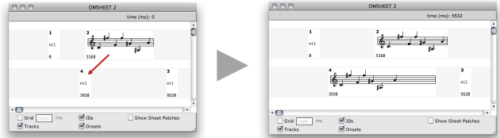](../res/drag-inside-sheet.png "Cliquez
pour agrandir")

The contents of an existing object can be replaced with a value of another
type.

[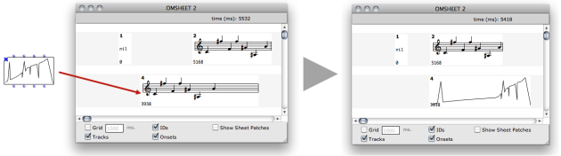](../res/drag-change-type.png "Cliquez pour
agrandir")

Deleting Objects Contents

Select an object and use the `SHIFT` \+ delete key ( `<=` ) to remove its
contents (reset the value to NIL).

Use `i` to reset the box initial size.

## Display

Several options allow to modify the general display of the sheet tracks. These
options do not modify its actual ("musial") contents.

Move / Switch / Resize Tracks

Use :

  * Up and Down arrow keys to change the size of selected track(s)
  * `SHIFT` \+ Up and Down arrow keys to change the position or spacing of selected track(s)
  * `ALT` \+ Up and Down arrow keys switch up/down the selected track(s)

[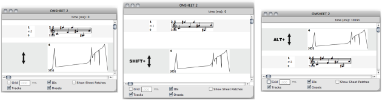](../res/change-tracks.png "Cliquez pour
agrandir")

Sow / Hide tracks

The `Tracks` box allow to choose to display or not the tracks in the
background.

|

Hiding tracks in the OMSheet editor.  
  
---|---  
  
Object Info

The `IDs` and `Onsets` boxes allow to choose to display or hide the onset (ms)
and the object ID on the individual objects.

|

[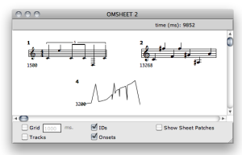](../res/IDs-and-Onsets.png "Cliquez pour
agrandir")  
  
---|---  
  
Score Attributes

Score objects appearance can be modified in the Sheet editor :

  * Select the object and use the Up and Down arrow keys to move the score vertically.

  * Right / `CTRL` click on the object to open the contextual menu and change the score font size and staff.

|

[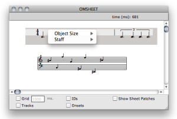](../res/staff-and-size.png "Cliquez pour
agrandir")  
  
---|---  
  
## Time Positions and Display

All the objects and internal events in the sheet are precisely positioned in
the time axis according to non-linear notation or other graphical constraints.

The `Grid` box and value field allow to display and set a regular temporal
grid on the score : you can see that this regular temporal grid rarely draws a
regular pattern, and changes depending on the objects in the score and their
relative positions.

The spacing of the grid units (here, of 1000ms = 1s) is optimized depending on
the graphical constraints of the objects in the score.

Moving Objects

Uset the `<=` and `=>` arrow keys to move the objects in the time axis (and
add `SHIFT` key to move them faster).

Aligning to the Grid

By pressing `a`, the object aligns its onset time to the current grid unit.

## Editing Objects

Double click on a Sheet object to edit its contents with the corresponding
editor.

|

[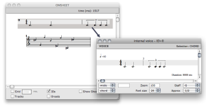](../res/internal-editor.png "Cliquez pour
agrandir")  
  
---|---  
  
Some Sheet Objects Editors...

  * [Score Editors](ScoreEditors)
  * [BPFs and BPCs Editors](BPFEditors)
  * [The Sound Editor](SoundEditor)
  * [The Maquette Editor](Editor)

## Playback

Use the standard score playback controls to play the sheet or some parts of
it.

If an interval or a set of specific objects are selected at launching the
player, only these parts of the score are played.

|

[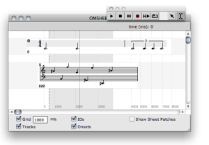](../res/play_3.png "Cliquez pour agrandir")  
  
---|---  
  
Score Playback Controls

  * [Play Controls](Editor-Play)

References :

Plan :

  * [OpenMusic Documentation](OM-Documentation)
  * [OM 6.6 User Manual](OM-User-Manual)
    * [Introduction](00-Sommaire)
    * [System Configuration and Installation](Installation)
    * [Going Through an OM Session](Goingthrough)
    * [The OM Environment](Environment)
    * [Visual Programming I](BasicVisualProgramming)
    * [Visual Programming II](AdvancedVisualProgramming)
    * [Basic Tools](BasicObjects)
    * [Score Objects](ScoreObjects)
    * [Maquettes](Maquettes)
    * [Sheet](Sheet)
      * Sheet Editor
      * [Sheet Box](Sheet-Box)
      * [Sheet Patches](Sheet-Patch)
    * [MIDI](MIDI)
    * [Audio](Audio)
    * [SDIF](SDIF)
    * [Lisp Programming](Lisp)
    * [Errors and Problems](errors)
  * [OpenMusic QuickStart](QuickStart-Chapters)

Navigation : [page precedente](Sheet "page précédente\(Sheet\)") | [page
suivante](Sheet-Box "page suivante\(Sheet Box\)")

