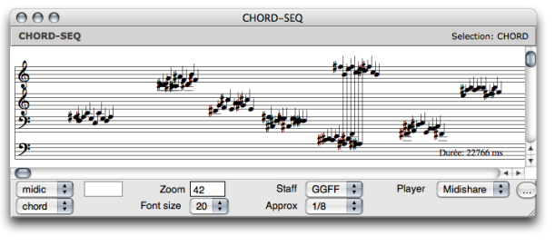

# Example : Building a Chord-Seq With a Synthesis Patch

This maquette contains several BPFs. The coordinates and temporal position of
each BPF is interpreted to produce a corresponding melodic sequence. The
sequences are then merged into one chord-seq. The whole process is programmed
in a synthesis patch.

## Programming the Synthesis Patch

General Program

|

The synthesis patch has been added in the workspace, dropped in the patch
editor and assine to the maquette.

The synthesis patch has :

  * a  **Maquette Self Input box** , which represents the maquette in which the patch is integrated,
  * an  **OMLoop** , which returns values for the chord-seq box,
  * a **chord-seq box**, connected to the synthesis patch's Tempout. 

The maquette's output returns the chord-seq produced by the synthesis patch.  
  
---|---  
  
OMLoop

The value of the Maquette Self Input is returned to OMLoop's input.

At each step of the loop, listloop returns the value of a TemporalBox to
slots. Each of these TemporalBoxes has a  **value** , a vertical position -
**posy** - and a temporal position - **offset** .

  * The value, or coordinates of each BPF are returned to car, which selects the y-points of the BPF. The y-points are returned to the "midic" input of the chord-seq.
  * The y-points of the curve are added to the "posy" of the TemporalBox, as for a transposition.
  * The offset of the box is returned to om+ and list, which return a list of the type (n (n+200)) to the chord-seq box. There will be a 200 ms interval between each of the chord-seq's items.

  1. At each step of the loop, acum builds a sequence out of the chord-seq and a "blank" chord-seq. 

  2. Finally returns the whole sequence to a global chord-seq, which is connected to the Tempout of the synthesis patch.

Inside the OMLoop : building the melodic sequence from the TemporalBoxes
parameters.

About Acum and Merger

Acum has three inputs :

  * something to collect,
  * an initial value, 
  * a function on "lambda" mode, which determins the behaviour of the acumulator. 

Here, merger builds a sequence out of the two chords-seqs. This sequence
includes the temporal value of the chord-seqs.

|

Merger merges two sequences into one, including their temporal value. As it
cannot merge something with "nil", we have assigned a "pseudo" empty chord-seq
to the initial value input of acum.  
  
---|---  
  
## Resulting Chord-Seq

Once the maquette is evaluated, the result of the synthesis can possibly be
visualized with a chord-seq box connected to the maquette's output. When the
maquette, or a selected TemporalBox is played, it renders the interpretation
of its values by the synthesis patch.

## Using the Maquette or Not

Here, as in most cases, the same program can be designed without a maquette,
if one is interested in a single abstraction level.

  * The maquette empathizes the temporal structure at stake in a process. It gives a global, and somehow intuitive view of this temporal dimension, which can be manipulated with the advantages of its specific graphic interface. 
  * The maquette provides a temporal representation of a process at a different abstraction level. 
  * Last, this temporal structure can be reinterpreted in a program. 

References :

Plan :

  * [OpenMusic Documentation](OM-Documentation)
  * [OM 6.6 User Manual](OM-User-Manual)
    * [Introduction](00-Sommaire)
    * [System Configuration and Installation](Installation)
    * [Going Through an OM Session](Goingthrough)
    * [The OM Environment](Environment)
    * [Visual Programming I](BasicVisualProgramming)
    * [Visual Programming II](AdvancedVisualProgramming)
    * [Basic Tools](BasicObjects)
    * [Score Objects](ScoreObjects)
    * [Maquettes](Maquettes)
      * [Creating a Maquette](Maquette)
      * [TemporalBoxes](TemporalBoxes)
      * [The Maquette Editor](Editor)
      * [Maquette Programming](Programming%20Maquette)
        * [Functional Components](InputsOutputs)
        * [Evaluation](MaquetteEvaluation)
        * [The Synthesis Patch](Synthpatchprog)
          * [Maquette Value](Synthesispatch)
          * Synthesis Patch Example
          * [Set-Eval Function](Seteval)
        * [TempBoxes Programming](TempProgramming)
      * [Maquettes in Patches](Maquettes%20in%20Patches)
    * [Sheet](Sheet)
    * [MIDI](MIDI)
    * [Audio](Audio)
    * [SDIF](SDIF)
    * [Lisp Programming](Lisp)
    * [Errors and Problems](errors)
  * [OpenMusic QuickStart](QuickStart-Chapters)

Navigation : [page precedente](Synthesispatch "page précédente\(Maquette
Value\)") | [page suivante](Seteval "page suivante\(Set-Eval Function\)")

