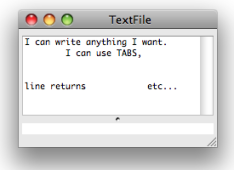
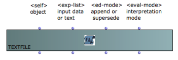

# TextFile Edition

## The Text Editor

|

The textfile box has a basic editor where texts can be edited or modified.

Double click on the box to open the editor.  
  
---|---  
  
## Inputs and Outputs

The textfile object has four inputs and outputs :

  1. "self" : the object itself

  2. "exp-list" : set or get the content of the object from/as a list. 

  3. "ed-mode" : edition mode, determines the way contents are added in the file.

  4. "eval-mode" : format to interprete and return the text to exp-list.

Exp-List : Contents

The " **exp-list** " input and output represent a textual content. The "exp-
list" input accepts :

  * single items - strings, numbers, etc.
  * lists, whose different items represent successive lines  in the  textfile .

It allows to set or read the contents of the  textfile box within visual
programs. The implementation and interpretation of the content depends on the
"eval-mode" and "ed-mode" inputs settings.

|

Inputting contents with "exp-list".  
  
---|---  
  
Ed-Mode : Overwrite or Append New Data

The " **ed-mode** " input determines the way input data is written in the text
file with **successive evaluations** **.** It offers two options :

  1. "supersede" : the previous content is **overwritten** by new data.

  2. "append" : new data is **appended after** the existing contents. 

Hence, the results of several successive iterations can be stored in the text
buffer.

Click on the input to select an option.

Left, "supersede" : each evaluation reinitializes the TextFile contents.
Right, "append" : the previous contents is kept in the TextFile.

Eval-Mode : Writing Format

The " **eval-mode** " input determines the **format** of the contents returned
by "exp-list".

Four formats are available :

  1. "text" : returns **a list of strings** corresponding to the successive lines of the text.

  2. "data list"  : returns the items as **a list** , matching each line of the text buffer, interpreted as **" raw" **d** ata ** . 

Several items on a line are gathered in the same list.

  3. "list" : returns an **elementary list** ignoring line returns.

  4. "value" : evaluates the first item of the text file and returns it as a single value. This is useful for files containing lists)

|

Three options for formatting the text contents with "eval-mode". The result
appears when evaluating the "exp-list" output.  
  
---|---  
  
References :

Plan :

  * [OpenMusic Documentation](OM-Documentation)
  * [OM 6.6 User Manual](OM-User-Manual)
    * [Introduction](00-Sommaire)
    * [System Configuration and Installation](Installation)
    * [Going Through an OM Session](Goingthrough)
    * [The OM Environment](Environment)
    * [Visual Programming I](BasicVisualProgramming)
    * [Visual Programming II](AdvancedVisualProgramming)
    * [Basic Tools](BasicObjects)
      * [Curves and Functions](CurvesAndFunctions)
      * [Array](ClassArray)
      * [TextFile](textfile)
        * TextFile Edition
        * [Outer Environment](TextFileEnvironment)
      * [Picture](Picture)
    * [Score Objects](ScoreObjects)
    * [Maquettes](Maquettes)
    * [Sheet](Sheet)
    * [MIDI](MIDI)
    * [Audio](Audio)
    * [SDIF](SDIF)
    * [Lisp Programming](Lisp)
    * [Errors and Problems](errors)
  * [OpenMusic QuickStart](QuickStart-Chapters)

Navigation : [page precedente](textfile "page précédente\(TextFile\)") |
[page suivante](TextFileEnvironment "page suivante\(Outer Environment\)")

