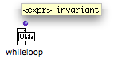

# WhileLoop : Defining Iteration Conditions

## General Properties

|

Whileloop allows a loop to go on **as long as a condition is fulfilled** .

It has only one default input : "expression", which defines a condition. This
condition can be expressed by a predicate[1] or any other value connected to
the input of whileloop.  
  
---|---  
  
## Example : Using Whileloop with a Predicate

A list that contains numbers and letters is enumerated until something else
than a number is reached.

  1. The list is enumerated by listloop. Each item returned by listloop is sent to the predicate numberp.

  2. Numberp tests if the item is a number, and returns "t" or "nil" .

  3. The result of the predicate is returned to whileloop. As long as whileloop gets "t", the loop goes on.

When numberp returns "nil", whileloop stops the loop, and finally returns
"done".

  4. At each step of the loop, the results returned by listloop and numberp are gathered in a list, and EachTime prints the list. 

|

  
  
---|---  
  
References :

  1. Predicate

A predicate verifies the property of a thing or a relation between two things.
It has two possible answers : "true", and "false", that is, "t", or "nil" in
Lisp.

Plan :

  * [OpenMusic Documentation](OM-Documentation)
  * [OM 6.6 User Manual](OM-User-Manual)
    * [Introduction](00-Sommaire)
    * [System Configuration and Installation](Installation)
    * [Going Through an OM Session](Goingthrough)
    * [The OM Environment](Environment)
    * [Visual Programming I](BasicVisualProgramming)
    * [Visual Programming II](AdvancedVisualProgramming)
      * [Abstraction](Abstraction)
      * [Evaluation Modes](EvalModes)
      * [Higher-Order Functions](HighOrder)
      * [Control Structures](Control)
      * [Iterations: OMLoop](OMLoop)
        * [Iteration](LoopIntro)
        * [General Features](LoopGeneral)
        * [Evaluators](LoopEvaluators)
        * [Iterators](LoopIterators)
          * [List Loop](ListLoop)
          * [OnList Loop](OnListLoop)
          * [For Loop](ForLoop)
          * While Loop
          * [Infinite Loops](InfiniteLoops)
        * [Accumulators](LoopAccumulators)
        * [Example : A Random Series](LoopExample)
      * [Instances](Instances)
      * [Interface Boxes](InterfaceBoxes)
      * [Files](Files)
    * [Basic Tools](BasicObjects)
    * [Score Objects](ScoreObjects)
    * [Maquettes](Maquettes)
    * [Sheet](Sheet)
    * [MIDI](MIDI)
    * [Audio](Audio)
    * [SDIF](SDIF)
    * [Lisp Programming](Lisp)
    * [Errors and Problems](errors)
  * [OpenMusic QuickStart](QuickStart-Chapters)

Navigation : [page precedente](ForLoop "page précédente\(For Loop\)") |
[page suivante](InfiniteLoops "page suivante\(Infinite Loops\)")

