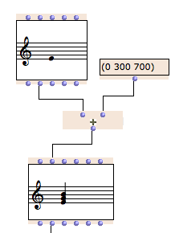
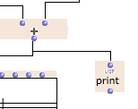
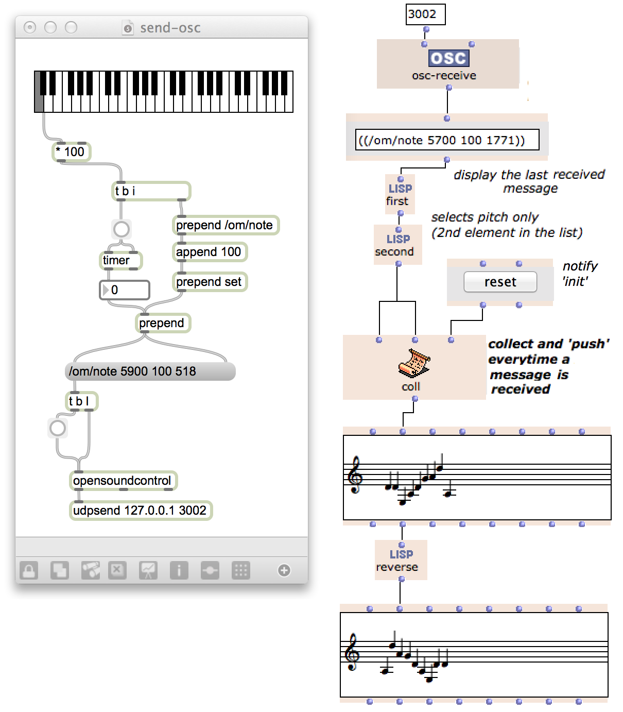
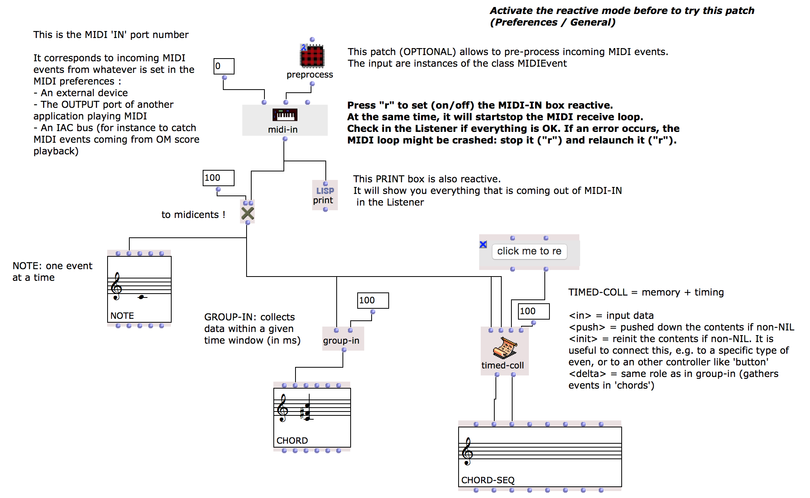

## Reactive visual programs in OM

The reactive mode in OM is an intermediate model for visual programming inheriting both from the off-line, demand-driven, computation paradigm of OpenMusic, and the reactive features of interactive/real-time systems. 
The objective is to integrate and control the interactions between CAC programs and their external context. 
In this model, visual programming components are capable of "listening" to the environment, or to other components of the programs, updating contents or triggering calculations accordingly, and propagating changes. 
This "dataflow-oriented" approach implies new semantic definitions, implementation and corresponding user interactions. 
It is based on the existing OM semantics and conservative with regard to this semantics, so that existing programs created in the environment remain valid in the reactive framework.

The OM reactive mode is available in OM >= 6.9.

### How to Use It:

* **Activate reactivity in OM "General" Preferences window.**

* Select boxes and type `R` to set their reactive status on/off.      
_Not all boxes can be made reactive. Reactive boxes are displayed with a coloured frame._

* Any modification to a reactive box will propagate downstream to the connected boxes that are also reactive.     
Modifications can be:
  * Evaluation (`V`) [=> the box has a new value]
  * Edition in the graphical editors or in the text field (for simple value boxes).
  * Modification of an input value
  * Action of an "interface" box (e.g. `slider`, etc.)
  * External update (e.g. _receive_ boxes -- see below)

**Notes:**

  * Reactivity applies to the first-order visual program, that is, not _inside the sub-patches_. A sub-patch (even if it contains reactive boxes) is still considered as an atomic function in the reactive context.
  
  * Use `om-send` and `om-receive` to send values and reactive updates between open patch editors.

  * In order to check what is going on, you can use a reactive `print` or `text-box` and connect it to your patch.

### Receiving from external applications: 

Reactivity can make particular sense for receiving data from external applications and updating/computing OM visual programs accordingly.

* Set an **`osc-receive`** or **`midi-in`** (OM 6.9) box reactive and the data will be propagated at every incoming message.     
This feature is compatible with the existing "lambda pre-processing" of incoming messages.      
**Note:** `OSC-receive`/`MIDI-in` might need to be turned off and on again if an error occurs during the propagation of an incoming event.
  
* The **`route`** and **`route-osc`** boxes can help routing incoming messages and notification. **`route-osc`** is a **`route`** which default test is a string comparison of the OSC messages' address.

* Several dedicated tools will allow to collect or group incoming data, such as **`coll`**, **`group`** or **`timed-coll`**.
  * **`coll`** has a temporary memory and allow to collect incoming data (can be seen as the reactive equivalent of an omloop _collect_. On update request, it behaves differently depending on the input: 
    * _in_ collects the data in a list
    * _push_ propagates the updates with the current contents of the list
    * _init_ reinitializes the memory
  * **`group`** has a configurable _delay_ (in ms). Within _delay_, updates are collected in a list before to propagate. 
  * **`timed-coll`** combines **`coll`** and **`group`** and uses a _delay_ parameter to collect lists of list from incoming data.

**Note:** if an error occurs in the the processing of an incoming event, the MIDI or OSC receive loop might stay stuck in a disabled state. In this case, you might need to turn off and on (`R`+`R`) the receive process.

### Example: Collecting/processing incoming MIDI using MIDI-IN

------
### Resources

  * J. Bresson, J.-L. Giavitto (2014) [A reactive extension of the OpenMusic visual programming language](https://hal.archives-ouvertes.fr/hal-00965747), Journal of Visual Languages and Computing.       
  _This paper gives a formal semantics of the reactive model in OM, as well as preliminary orientation for its implementation. An extended state of the art and study of related works is given._

  * J. Bresson (2014) [Reactive Visual Programs for Computer-Aided Music Composition](https://hal.archives-ouvertes.fr/hal-01055239). IEEE Symposium on Visual Languages and Human-Centric Computing -- VL/HCC, Melbourne, Australia, 2014.      
  _This paper presents the reactive programming framework in OpenMusic, highlighting some characteristics of the programming and computation paradigms involved. It describes its implementation, and shows some preliminary extensions and applications._

  * [EFFICACe project report](https://hal.archives-ouvertes.fr/hal-01142078) including semantics, implementation and preliminary applications.

